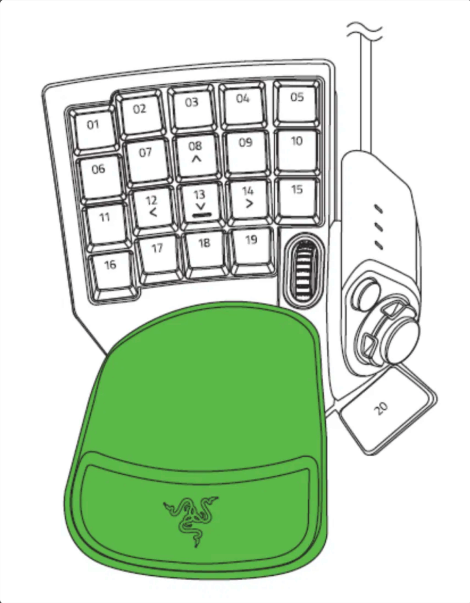

# Tartarus V2 Linux Configurator



Linux-Treiber + grafische Konfigurationsoberfläche für die Razer Tartarus V2 (KDE Plasma / PySide6).

## Über dieses Projekt

Razer bietet keine offizielle Linux-Unterstützung für die Tartarus V2 (Synapse ist Windows-only).
Dieses Projekt baut auf dem quelloffenen Kernel-Treiber von
[Drayux/Tartarus](https://github.com/Drayux/Tartarus) auf und ergänzt ihn um:

- Modifier-Tasten (Strg/Shift/Alt/Meta) als Teil eines Binds, z.B. Strg+1 auf eine Taste legen
- einen konfigurierbaren Mausrad-Klick (Taste, Profilwechsel, inkl. Modifier)
- ein sauberes Python-Backend (`tartarus_backend.py`) für die sysfs-Schnittstelle des Treibers
- eine native Qt/PySide6-GUI (`tartarus_gui.py`) zur Bearbeitung der 8 Geräteprofile direkt
  auf einer Abbildung des Geräts (statt einem generischen Tasten-Raster), inkl. Live-Anzeige
  gedrückter Tasten während der Konfiguration
- eine udev-Regel für Schreibzugriff ohne root

## Komponenten

| Datei | Zweck |
|---|---|
| `tartarus.c`, `module.h`, `keymap.h`, `dkms.conf`, `Makefile` | Kernel-Treiber (basiert auf Drayux/Tartarus, um Modifier-Binds und Mausrad-Profile erweitert) |
| `tartarus_backend.py` | Python-API für Profile lesen/schreiben (Tastatur + Maus) |
| `tartarus_gui.py` | Grafische Oberfläche |
| `tartarus_v2.svg` | Geräte-Grafik für die GUI (benannte Elemente `Key_1`–`Key_20`, `Circle`, `Cross`, `Scroll`) |
| `tartarus_svg.py` | Liest Position/Form/Drehung der Tasten direkt aus `tartarus_v2.svg` |
| `tartarus_layout.py` | Fallback-Koordinaten für Elemente, die (noch) nicht in der SVG benannt sind |
| `tartarus_macros.py` | Makro-Datenmodell + Speicherung (`~/.config/tartarus/macros.json`) |
| `tartarus_macro_gui.py` | Dialog zum Aufnehmen/Bearbeiten eines Makros |
| `tartarus_macro_daemon.py` | Hintergrunddienst: spielt Makros bei Tastendruck über `uinput` ab |
| `tartarus-macros.service` | systemd-`--user`-Unit für den Wiedergabe-Dienst |
| `99-tartarus.rules` | udev-Regeln (Gruppe `tartarus`: Profil-Dateien + `/dev/uinput`) |

## Status

Alle 25 physischen Tasten (1-20, Circle, Steuerkreuz) sowie der Mausrad-Klick sind vollständig
getestet und konfigurierbar, inklusive Modifier-Tasten (Strg/Shift/Alt/Meta) pro Bind. Das
Steuerkreuz (Cross) ist am Gerät eine einzelne 4-Wege-Wippe mit vier unabhängigen Binds
(Oben/Rechts/Unten/Links) — ein Klick in der GUI öffnet dafür eine kleine Richtungsauswahl.
Mausrad-Scrollen (hoch/runter) hat weiterhin Festverhalten und ist noch nicht konfigurierbar.

## Live-Tastenanzeige

Beim Konfigurieren zeigt die GUI gedrückte Tasten in Echtzeit an: Wird eine physische Taste
gedrückt, leuchtet der zugehörige Button auf und zeigt die aktuell zugewiesene Belegung.

Technisch hört die GUI dazu auf das evdev-Gerät der Tartarus (`/dev/input/eventX`) und
gleicht die gemeldete (bereits gemappte) Taste mit dem geladenen Profil ab, um die
physische Taste zurückzuermitteln. Das hat zwei Konsequenzen:

- Benötigt das Python-Paket `evdev` (`pip install evdev`) sowie Lesezugriff auf
  `/dev/input/eventX` (auf den meisten Distros bereits über die Gruppe `input` bzw.
  systemd-logind-ACLs gegeben — keine zusätzliche udev-Regel nötig)
- Tasten mit Bind-Typ **Hypershift**, **Profil wechseln** oder **Nichts** lösen kein
  reguläres Key-Event aus (der Treiber verarbeitet sie intern) und leuchten daher beim
  Drücken nicht auf — nur **Taste**- und **Makro-Slot**-Binds sind sichtbar
- Fehlt `evdev` oder wird kein passendes Eventgerät gefunden, startet die GUI trotzdem
  normal, nur ohne die Live-Anzeige (Hinweis dazu erscheint in der Statusleiste)

## Makros

Eine Taste mit Bind-Typ **Makro-Slot** lässt den Treiber beim Drücken `KEY_MACRO1`–`KEY_MACRO30`
statt einer normalen Taste melden (siehe `CTRL_MACRO` in `resolve_event_kbd()`, `tartarus.c`).
Was dabei tatsächlich passiert, entscheidet der separate Wiedergabe-Dienst:

- **Aufnehmen/Bearbeiten:** Im Bind-Dialog bei „Makro-Slot" auf „Makro-Inhalt
  aufnehmen/bearbeiten…" klicken. Zwei Wege, auch kombinierbar:
  - **Live-Aufnahme:** Zielgerät (deine echte Tastatur) auswählen, „Aufnahme starten",
    Tastenfolge eingeben, „Aufnahme stoppen" — Timing wird automatisch mit aufgezeichnet.
    Während der Aufnahme wird das gewählte Gerät exklusiv gegriffen (Tasten gehen nicht
    zusätzlich an den Rest des Desktops).
  - **Manuell:** Taste + Drücken/Loslassen + Verzögerung einzeln hinzufügen.
  - Makros werden in `~/.config/tartarus/macros.json` gespeichert, unabhängig vom
    Geräteprofil (Slot-Nummern 1–30 sind global, wie auf dem Gerät selbst).
- **Wiedergabe:** Läuft über `tartarus_macro_daemon.py`, ein eigener Hintergrunddienst
  (nicht Teil von `tartarus_gui.py` — Makros sollen auch ohne offene GUI funktionieren).
  Er hört auf das Tartarus-Event-Gerät und spielt die passende Tastenfolge über ein
  virtuelles `uinput`-Tastaturgerät ab. Einrichtung:

  ```bash
  sudo modprobe uinput   # falls das Modul noch nicht geladen ist
  # 99-tartarus.rules (siehe Installation) enthält bereits die nötige udev-Regel für /dev/uinput

  mkdir -p ~/.config/systemd/user
  cp tartarus-macros.service ~/.config/systemd/user/
  systemctl --user daemon-reload
  systemctl --user enable --now tartarus-macros.service
  ```

  Status prüfen: `systemctl --user status tartarus-macros.service`

## Bekannte Einschränkungen

- Mausrad-Scrollen (hoch/runter) ist weiterhin fest verdrahtet, nicht konfigurierbar
- Interface 1 (EXT) hat im Original-Treiber keine aktive Funktion (Stub)
- Live-Tastenanzeige funktioniert nur für Taste- und Makro-Slot-Binds (siehe oben)
- Profile im alten 2-Byte-Format (vor v0.2, ohne Modifier-Unterstützung) werden beim
  Einlesen automatisch erkannt und weiterhin unterstützt, aber beim nächsten Speichern
  ins neue 3-Byte-Format migriert

## Installation

```bash
sudo groupadd -f tartarus
sudo usermod -aG tartarus $USER
sudo cp 99-tartarus.rules /etc/udev/rules.d/
sudo udevadm control --reload-rules

sudo dkms add -m tartarus -v 0.2
sudo dkms build -m tartarus -v 0.2
sudo dkms install -m tartarus -v 0.2
sudo modprobe tartarus

pip install pyside6 evdev   # oder: sudo pacman -S pyside6 python-evdev
python3 tartarus_gui.py
```

> Manche Kernel-Varianten sind mit clang statt gcc gebaut (z.B. bei CachyOS: `-cachyos`
> mit Clang, `-cachyos-bore` mit GCC — beides gleichzeitig installierbar). `dkms.conf`
> prüft das automatisch anhand von `CONFIG_CC_IS_CLANG` in der Kernel-`.config` und hängt
> `LLVM=1` nur an, wenn der jeweilige Kernel das auch tatsächlich braucht — funktioniert
> also unverändert, egal welche Kernel-Variante gerade installiert/aktiv ist.

### Update von v0.1

Das Profil-Binärformat hat sich geändert (2 → 3 Byte pro Taste, für Modifier-Support).
Vorhandene v0.1-Profile werden beim Lesen automatisch erkannt, sind also nicht verloren.
Um den Treiber selbst zu aktualisieren:

```bash
sudo dkms remove tartarus/0.1 --all
sudo dkms add -m tartarus -v 0.2
sudo dkms install -m tartarus -v 0.2
sudo rmmod tartarus && sudo modprobe tartarus
```

## Lizenz-Hinweis

Die Kernel-Treiber-Dateien (`tartarus.c`, `module.h`, `keymap.h`, `dkms.conf`, `Makefile`)
stammen vom [Drayux/Tartarus](https://github.com/Drayux/Tartarus)-Projekt und stehen unter
dessen Lizenz (GPL, siehe `MODULE_LICENSE("GPL")` in `module.h`). Die Python-Tools
(`tartarus_backend.py`, `tartarus_gui.py`) sind eigene Arbeit für dieses Projekt — falls
du dafür eine eigene Lizenz festlegen willst (z.B. MIT), füg gerne eine `LICENSE`-Datei
hinzu, bevor das Repo public geht.
